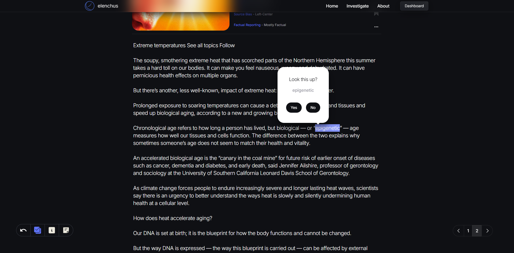
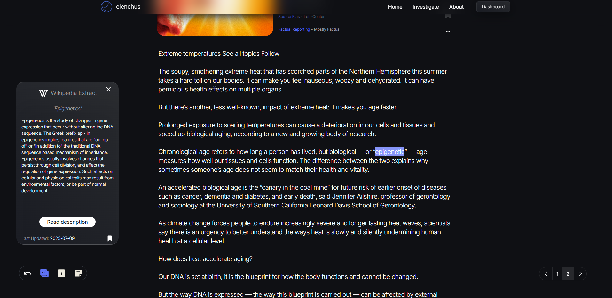

# Elenchus

Elenchus is a focused research platform that applies the Socratic method to modern media.  
It guides users through structured questioning to challenge assumptions and biases,  
then retrieves and summarizes relevant news articles with bias ratings and 
metadata - all inside a performant, interactive interface optimized for large-scale content.

## Since launch, Elenchus has evolved into a **production-grade full-stack application** featuring:

- Wikipedia Context Extraction - when relevant, automatically pulls concise Wikipedia summaries 
for key people, events, or topics mentioned in articles, providing instant background context 
without leaving the app.




- Bias & Integrity Tracking Dashboard - generates charts that visualize 
trends in: 1. Political bias of sources you reference, 2. Journalistic integrity ratings over time, 
and 3. How your perspecitves have been effected by your investigations over time.

- Topic Discovery via Bluesky Feed - Displays a curated feed of recent Bluesky posts, 
allowing users to discover trending or thought-provoking topics. Users can search 
for specific themes being discussed and launch investigations directly 
from these posts — no need to start from scratch.

- Virtualized infinite scrolling on large lists of data for performance at scale

- Concurrent API request handling with fault tolerance

- Integrated media bias and reliability ratings via MBFC API

- Server-side Supabase operations for secure, efficient data handling

## Table of Contents

1. Features

2. Tech Stack

3. Architecture

4. Prerequisites

5. Installation

6. Configuration

7. Running the App

8. Usage

9. Deployment

10. Contributing

11. License

## Features

##### Socratic Reflection Workflow:

Guide users to pinpoint a statement they’re unsure about, then prompt them to articulate underlying assumptions, biases, and questions before beginning their research.

##### Article Search & Summarization:

Fetch news via the Bing News API and scrape article content via TLDRThis API.

##### Argument Mapping:

Record your thought process and link evidence to claims.

##### User Profiles:

Secure authentication and data persistence with Supabase.

##### Smooth Animations:

Mount/unmount transitions and interactive elements via Framer Motion.

## Tech Stack

Frontend: Astro.js + React SPA

Backend: Node.js + Express.js

Database & Auth: Supabase

Styling: Tailwind CSS

Animations: Framer Motion + Lottie-React

API Integration: Bing News API

## Architecture

[Client (Astro/React)] <--> [API Server (Express)] <--> [Supabase DB]
\---> [Bing News API]

Client: Renders interactive pages, handles routing(React-Router-Dom) and state (Redux Toolkit).

Server: Exposes REST endpoints, handles user sessions, proxies news requests, and sanitizes responses.

Database: Stores user profiles, saved investigations, and article metadata.

## Prerequisites

Node.js 24.x

npm 11.x

Supabase project (for Auth and DB)

Bing News API key

RapidAPI API key

## Installation

Clone the repo

git clone https://github.com/yourusername/elenchus.git
cd elenchus

Install dependencies once from the repository root:

```sh
npm ci
```

The npm workspaces are `client` (package `elenchus`), `server`, and
`packages/contracts` (package `@elenchus/contracts`). The root lockfile is
authoritative. Use `npm install` to update dependencies; do not maintain nested lockfiles.
Both applications import shared schemas from contracts. The old schema paths
re-export shared definitions for compatibility; server-only schemas and validators
remain local. A shared HTTP route registry is still a separate step.

## Configuration

Environment Variables

Create a .env file in /server:

SUPABASE_URL=<your-supabase-url>
SUPABASE_KEY=<your-supabase-key>
NEWS_API_KEY=<your-bing-news-api-key>

Optionally, create a .env in /client for client-specific configs.

## Running the App

Development

### From project root

Run these in separate terminals:

```sh
npm run dev:client
npm run dev:server
```

The client runs at http://localhost:5173. The server rebuilds and restarts on
TypeScript changes, using its configured port (the client proxy expects 5001).
After editing shared schemas, run `npm run build:contracts`.

Production Build

npm run build
npm run start

Use `npm run typecheck` to check all workspaces. Individual builds are
`npm run build:contracts`, `npm run build:server`, and `npm run build:client`.
Application build commands compile contracts first.

## Docker development

Use Docker Desktop with Linux containers and Docker Compose 2.32 or newer.
Supabase remains hosted; this setup runs only the API and Astro dev server.

1. Create `server/.env` from `server/.env.example` if it does not already exist,
   and fill in all credentials required by the server. Existing `server/.env`
   files can be reused. No secrets are copied into the image.
2. If needed, place client settings in `client/.env`. Never put the Supabase
   service key in client configuration.
3. From the repository root, run:

```sh
docker compose up --build --watch
```

Open http://localhost:5173 once the API and client startup messages appear.
The API is also available at http://localhost:5001. Stop any local development
servers already using those ports first.

Compose Watch copies source edits into the containers, where Astro and nodemon
use native Linux file notifications. No Windows source bind mounts or polling
are needed. Astro hot reloads, the API rebuilds contracts and restarts after a
one-second debounce, and the client watches shared contracts separately.
Dependencies and generated output stay inside the containers.
Astro proxies API requests to `http://api:5001` on the Compose network; normal
non-Docker development retains `http://localhost:5001`.

Compose Watch rebuilds images when package manifests, the lockfile, or Dockerfile
change. After changing Compose configuration or adding a new source directory
outside the watch rules, restart with `docker compose up --build --watch`.
Keep watch mode running for live edits; plain `docker compose up` starts the
built snapshot without synchronizing later edits.
After changing environment files, recreate the services with
`docker compose up --force-recreate`. Stop them with `docker compose down`.
Use `docker compose logs -f api` to inspect server startup errors.

This uses the Supabase project specified in `server/.env`, including its real
data. Auth redirect settings should include your localhost development URL.
The old PostgreSQL, pgAdmin, and nginx services are no longer part of this setup.
Production serving through Express remains separate from this development setup.

## Usage

Register or log in via Supabase OAuth.

Enter a statement or belief in the investigation flow.

Answer guided reflection prompts.

Browse and select articles; view AI‑generated summaries.

Save investigations to your profile or export data.

## Deployment

This project is organized as a monorepo with separate client and server folders and is deployed as a single Heroku app.

Create & Configure Heroku App

heroku login
heroku create your-app-name

Monorepo Build Setup

Build from the repository root using the Node.js buildpack. Include development
dependencies during the build for Astro and TypeScript. The root
`heroku-postbuild` copies logo assets and runs the ordered workspace build.
Do not scope deployment to only the server directory; all workspaces are needed.

Procfile
In the project root, create a file named Procfile containing:

web: npm start

Environment Variables
Set required keys via CLI or Heroku dashboard:

heroku config:set \
 SUPABASE_URL=<your-supabase-url> \
 SUPABASE_KEY=<your-supabase-key> \
 NEWS_API_KEY=<your-bing-news-api-key>

Deploy
Commit your changes and push to Heroku:

git push heroku main

Heroku will install dependencies, build the client, and launch the server automatically.

Verify Deployment
Visit https://your-app-name.herokuapp.com to confirm everything is running correctly.

## Contact

Trent Irvin – trentirvin51@gmail.com

Said Gadzhiev - saga080700@gmail.com

Project Link: https://github.com/TrentM1997/ElenchusBackup
