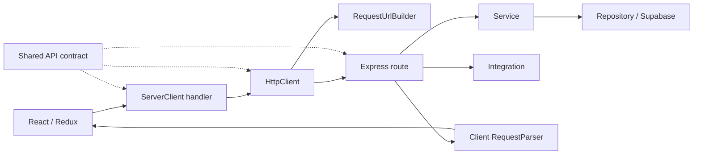

# Architecture

Elenchus is an npm workspace repository with an Astro/React client, an Express server, and a shared TypeBox contracts package. Hosted Supabase provides authentication and persistence. NewsAPI, Firecrawl, Wikipedia, and Bluesky are accessed through server-side services or integrations.

## Request flow



ServerClient composes public (`general`) and private (`privileged`) handlers. A handler supplies a contract entry and request options to `HttpClient.request`. The URL builder fills path placeholders and serializes queries; HttpClient handles transport. RequestParser validates and unwraps successful responses.

On the server, AppServices composes services and integrations. RouteRegistrar reads the contract's method and path and registers an Express handler. The handler explicitly validates inputs, invokes the service or integration, handles failures, validates the output, and sends the response.

The registrar does not automatically perform validation or authentication. Those responsibilities remain visible in route handlers and middleware.

## Contract and schema ownership

The source of truth is `packages/contracts/src`:

| File or directory               | Responsibility                                   |
| ------------------------------- | ------------------------------------------------ |
| `contract/apiContracts.ts`      | Feature-level endpoint entries                   |
| `contract/apiContractConfig.ts` | Public/private groups and combined configuration |
| `contract/types.ts`             | Shapes accepted by contract definitions          |
| `schemas/`                      | Shared data schemas and inferred types           |

Entries use `as const satisfies ...` to retain specific schema types while checking their structure. Request locations are separate: `bodySchema` describes JSON, `querySchema` describes the query object, and `paramsSchema` describes named path parameters.

Client `RequestOptions<R>` uses conditional types and TypeBox `Static<S>` to infer each location. A declared schema makes its corresponding option required; an absent schema gives an optional `never` property, preventing callers from supplying it. `NoInfer<R>` keeps the options from changing inference of the selected route. The response type is `Static<R["outputSchema"]>`.

Import shared definitions through `@elenchus/contracts` exports. Local compatibility schema files have been removed. Server-specific schemas remain local where they describe persistence inputs, authenticated IDs, or upstream payloads.

## URL construction and transport

RequestUrlBuilder is injected into HttpClient. Handlers pass raw values:

```ts
await this.http.request(this.routes.articles.poll, {
  params: { jobId },
  signal,
});
```

The builder replaces `:jobId` with its encoded value. Query values are scalar and serialized with URLSearchParams; arrays travel in POST JSON bodies. Encoding happens here once, rather than in handlers.

HttpClient dispatches GET, POST, or DELETE from the contract, includes cookies through `credentials: "include"`, and forwards AbortSignal. It reports HTTP and network failures through ServerRequestError; cancellation remains cancellation.

The contract method type also allows other HTTP verbs, but adding one requires implementing it in both HttpClient and RouteRegistrar first.

## Validation boundaries

| Boundary                   | Check                                                                                                                         |
| -------------------------- | ----------------------------------------------------------------------------------------------------------------------------- |
| Client call                | Contract-derived request and response types                                                                                   |
| Server request             | `validateOrThrow` validates body, query, or params; invalid input becomes a 400                                               |
| Persistence / integrations | Their validators check external data before returning it                                                                      |
| Server response            | `Static<typeof route.outputSchema>` checks compatibility at compile time; `validateServerOrThrow` checks the value at runtime |
| Client response            | RequestParser validates the success envelope and then the contract's output data                                              |

Services use typed interfaces and typically return `DbResult<T>` from persistence. They coordinate operations and enforce application rules. They do not need the HTTP output schema passed into them; the route owns that boundary.

Compile-time types catch incompatible application changes during development. Runtime checks validate values arriving across I/O boundaries.

Path parameters arrive as strings. Routes validate those strings and explicitly convert numeric IDs before calling services. Validation does not implicitly coerce them.

## Responses and errors

`res.success(message, data, status)` sends:

```ts
{
  status: "success",
  message,
  data,
}
```

An endpoint's outputSchema describes data. Some payloads contain their own `{ ok, data }` service result, so that inner wrapper is distinct from the HTTP envelope. RequestParser returns the validated envelope data.

Routes keep their service failure checks and HTTP statuses. wrapAsync forwards thrown errors to Express; the global error handler maps ClientError and ServerError to response envelopes. Invalid server output becomes a 500. Client HttpClient handles non-success HTTP statuses before success parsing.

## Authentication and persistence

configSessionHandler creates a request-scoped auth client and attaches req.auth. Protected routes run authenticate and requireAuth. Services use requireAuthenticated to validate the supplied user ID and return the branded AuthenticatedUserId required by protected persistence operations.

Repository return values use `DbResult<T>`, with either `{ ok: true, data: T }` or a failure containing a message and optional details. Database payload validation stays in persistence.

Signup and account deletion use isolated Supabase clients to avoid changing the shared repository client's session state. See the [auth client isolation notes](../server/db/access/repositories/user/README.md).

## Adding an endpoint: the feedback pattern

Use the existing feedback endpoint as a model.

### 1. Declare the contract

In apiContracts.ts, the public user contract contains:

```ts
feedback: {
  path: "/user/feedback",
  method: "POST",
  bodySchema: Type.Object({ feedback: FeedbackReqSchema }),
  outputSchema: FeedbackResponseSchema,
},
```

For a new endpoint, add its entry to the appropriate feature contract and update the associated shape in contract/types.ts. Expose a new feature group through apiContractConfig.ts when needed. Rebuild contracts so both applications resolve the updated exports.

### 2. Register and validate on the server

Inside the public route registration function:

```ts
const feedbackRoute = PUBLIC_API_CONFIG.user.feedback;

registrar.register(
  router,
  feedbackRoute,
  wrapAsync(async (req, res) => {
    const { feedback } = validateOrThrow(feedbackRoute.bodySchema, req.body);

    const result: Static<typeof feedbackRoute.outputSchema> =
      await app.services.api.user.submitFeedback(feedback);

    if (!result.ok) {
      throw new ServerError("Failed to submit feedback", 500, result.details);
    }

    const data = validateServerOrThrow(feedbackRoute.outputSchema, result);
    res.success("Feedback submitted successfully", data, 200);
  }),
);
```

Use the private route file for authenticated endpoints. When a service can return values outside the response contract, handle that branch before assigning the response type, as the polling route does for a missing job.

### 3. Call through a client handler

Inside UserRouteHandler:

```ts
const route = this.routes.user.feedback;
return await this.http.request(route, { body: { feedback } });
```

The contract requires the outer feedback property and determines the return type. The handler doesn't repeat the HTTP method, URL, or response schema.

For new functionality, expose the handler through the relevant public/private client interface. Add an Astro proxy prefix if the new URL falls outside the existing prefixes.

### 4. Verify

Run workspace typechecks, client tests, and built server route tests as listed in the root README. Cover the request shape, service arguments, successful response, and rejection of malformed output where relevant.

## Build and development

Contracts compile to ESM JavaScript and declarations under packages/contracts/dist. Both applications depend on that workspace package. Root builds compile contracts before applications; import the package exports rather than raw sibling source files.

Docker Compose runs Astro and Express separately with Compose Watch and hosted Supabase. Production Express serves the built Astro client. See the [root README](../README.md) for commands and environment configuration.
